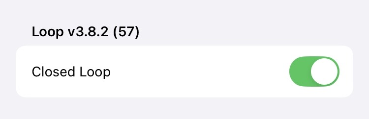

## Loop Releases

The new features added with each Loop release are provided for reference.

For information about version 2 releases and compatibility between version 2 and 3, refer to [Older Releases](releases-version2.md){: target="_blank" }.

- - -

## Current Release

The current released version for the *Loop* app is v3.8.2 and is built from the `main` branch of LoopWorkspace. The dates and contents for releases are summarized below in reverse chronological order (so newest release information comes first).

> When main was updated to v3.8.2, the same update was made to the`dev` branch. At this time, the `dev` branch is identical to `main` with the exception of the version number, which is at 3.9.2.

When there are updates to `dev`, differences between `main` and `dev` will be summarized in [Updates in `dev`](development.md#updates-in-dev){: target="_blank" }.

### What Version Do I Have?

Tap on the Settings icon at the toolbar of the *Loop* app and look at the version information at upper left.
    
{width="400"}
{align="center"}

### Is the Released Version Newer?

Release information is found on the [*GitHub*&nbsp;_LoopKit/LoopWorkspace_&nbsp;release page](https://github.com/LoopKit/LoopWorkspace/releases).

Releases from `Loop v3.4.4` and older are reported at [*GitHub*&nbsp;_LoopKit/Loop_&nbsp;release page](https://github.com/LoopKit/Loop/releases).

- - -

## Loop 3 Version History

- - -

## Loop v3.8.x

!!! important "[iOS 15 is no longer supported](../build/phone.md#not-supported){: target="_blank" }"
    * It is a known issue that some screens show up as a different language for iOS 15 devices with v3.8.x.
    * It is expected *Loop* will soon require a minimum of iOS 17

    See [Compatible Device](../build/phone.md#compatible-device){: target="_blank" }.

### Loop v3.8.2

[*Loop* v3.8.2](https://github.com/LoopKit/LoopWorkspace/releases/tag/v3.8.2) was released on 31 October 2025.

**Warning - Dana users - this version does not support Dana but 2 alternate branches are available. Choose one of those to build to continue using your pump. Please read the note below:**

* [Why was DanaKit Support Changed?](#why-was-danakit-support-changed)

!!! warning "Browser Build Disabled?"
    We do not know why, but GitHub is disabling the Build Loop Action for many user's LoopWorkspace fork.

    * We think it is associated with running too many builds at a busy time that requested too many runners (virtual computers)
    * The redesigned build action for v3.8.2 should alleviate this
    * We also plan to reach out to GitHub after people have transitioned to the v3.8.2 build schedule

> Please follow these steps to build manually:

> * [What Manual Action is Required?](../browser/automatic.md#what-manual-action-is-required){: target="_blank" }

#### Updates in v3.8.2

This version updates a few iOS 26 interface issues, moves support for Dana pumps to a different branch, and streamlines and enhances the Browser Build process.

* Restore expected behavior for phones running iOS 26
    * see [Loop PR 2371](https://github.com/LoopKit/Loop/pull/2371) / [LoopKit PR 573](https://github.com/LoopKit/LoopKit/pull/573)
* Modify the build schedule to run on Sundays and build on the second Sunday of each month
    * see [Updated Build Features](../browser/automatic.md#updated-build-features){: target="_blank" } details

* [Remove DanaKit](#why-was-danakit-support-changed) support from `main` and `dev` branches of the *Loop* app
* Update some translations

> When main was updated to v3.8.2, the same update was made to the`dev` branch. At this time, the `dev` branch is identical to `main` with the exception of the version number, which is at 3.9.2.

#### Why was DanaKit Support Changed

> **A pump manager that works for Trio must be separately tested for Loop**

* Several issues were reported regarding bolus accounting and IOB reporting for *Loop* v3.8.1
* For this reason, Dana support is only found in 2 special branches

If you were using Dana with v3.8.1, a branch called `release/3.8.1` was created for your continued use.

* The `release/3.8.1` branch will remain available while troubleshooting continues
* This branch is meant to support people already using Dana with v3.8.1 who understand how to manage the issues with that version

If you are an expert and want to use [Dana](../loop-3/add-pump.md#dana-in-loop-requires-expert-testing){: target="_blank" } or [Medtrum](../loop-3/add-pump.md#medtrum-in-loop-requires-expert-testing){: target="_blank" }, the experimental branch is `feat/dev-dana-medtrum`

* This branch is subject to rapid updates
* Please do not use Dana with Loop unless you are willing to test and communicate with [developers on zulipchat in this DanaKit channel](https://loop.zulipchat.com/#narrow/channel/144182-development/topic/DanaKit.20Troubleshooting/with/547829260)

* Please do not use Medtrum with Loop unless you are willing to test and communicate with [developers on zulipchat in the Medtrum channel](https://loop.zulipchat.com/#narrow/channel/144182-development/topic/Medtrum.20Nano.20-.20pumps.20for.20development.20use/with/481836247)

### Loop v3.8.1

[*Loop* v3.8.1](https://github.com/LoopKit/LoopWorkspace/releases/tag/v3.8.1) was released on 23 September 2025.

This was released as a hotfix:

* the designed behavior of tapping on the bolus line should automatically replace the recommended value with zero
* this stopped working after changes were made to this interface to accommodate iOS 26

When putting together the hotfix, the following additional updates were included:

* Bring in updates from DanaKit
* Restore expected behavior for G6 of going to CGM Manager screen, instead of the Dexcom app, when tapping on glucose in the HUD
* Update Gemfile and Gemfile.lock to fix a security warning
* Add audio capability to Loop to support DanaKit optional behavior and possible OmniBLE InPlay/iPhone 16 work-around later
    * Dana users no longer need to modify the code to use [Background Sound](../troubleshooting/dana-faq.md#background-sound){: target="_blank" } if their CGM does not have a heartbeat
* Update some translations

> When main was updated to v3.8.1 for a hotfix, the same hotfix was applied to the `dev` branch, which is at v3.9.1.

### Loop v3.8.0

[*Loop* v3.8.0](https://github.com/LoopKit/LoopWorkspace/releases/tag/v3.8.0) was released on 14 September 2025.

> When v3.8.0 was released, the `dev` branch version was similarly updated to v3.9.0

#### v3.8.0 Highlights

* Add support for Dana-i and DanaRS-v3 pump models
* Update translations and convert to String Catalogs
* Update to support iOS 26

#### Limitations for *iOS* 15

Note that iOS 15 devices do not support:

* *Loop Widgets*, however, *Loop Widgets* continue to work with iOS 16 devices and iOS 18 and newer devices now support tinted widgets.
* The Mixpanel Service is not available

- - -

## Loop v3.6.x

### Loop v3.6.4

[*Loop* v3.6.4](https://github.com/LoopKit/LoopWorkspace/releases/tag/v3.6.4) was released on 31 July 2025.

This release:

* provides support for newer European Libre 2 plus sensors (mid 2025 Libre 2 plus EU sensors)
* adds localization to the LibreTransmitter module
* adjusts build dependencies for G7SensorKit (no functional change)
* shifts the automatic build time from hh:00 to hh:33
    * automatic builds have been running into errors recently
    * this time shift avoids a time when GitHub resources are impacted

> The updates applied to `main` for v3.6.4 were also applied to `dev` in v3.7.4.

### Loop v3.6.3

[*Loop* v3.6.3](https://github.com/LoopKit/LoopWorkspace/releases/tag/v3.6.3) was released on 10 July 2025.

This release fixes [Loop Issue 2322: Negative interrupted bolus](https://github.com/LoopKit/Loop/issues/2322).

* The bug was that the amount reported after an interrupted bolus could be incorrect
    * This bug was reported when a user **heard a pod fault** and tried to **manually interrupt the bolus**
    * This release ensures the amount not delivered is only subtracted once for all cases

> The updates applied to `main` for v3.6.3 were also applied to `dev` in v3.7.3.

### Loop v3.6.2

[*Loop* v3.6.2](https://github.com/LoopKit/LoopWorkspace/releases/tag/v3.6.2) was released on 25 June 2025.

There are no changes to the *Loop* app - this is a Browser Build fix only.

This release is the second fix for Browser Build features that stopped working when Apple made changes to their infrastructure beginning in May 2025. Those with valid Identifiers and build credentials probably did not notice that there was a problem.

**Fixed**

* The ability to run the `Add Identifiers` action is fixed with this version

**Not Fixed**

This only affects new builders and the instructions are updated to accomodate this restriction.

* We can no longer automatically enable the capability for Time Sensitive Notifications for Loop. This capability must be added manually as directed in this section: [Add Time Sensitive Notifications](../browser/prepare-app.md#add-time-sensitive-notifications){: target="_blank" }

> The updates applied to `main` for v3.6.2 were also applied to `dev` in v3.7.2.

### Loop v3.6.1

[*Loop* v3.6.1](https://github.com/LoopKit/LoopWorkspace/releases/tag/v3.6.1) was released on 13 June 2025.

There are no changes to the *Loop* app - this is a Browser Build fix only.

This release partially restored some Browser Build features that stopped working when Apple made changes to their infrastructure beginning in May 2025. Those with valid Identifiers and build credentials probably did not notice that there was a problem.

**Fixed**

* The ability to generate new build credentials after certificates expired or were deleted is fixed with this version

**Not Fixed**

* The ability to run the `Add Identifiers` action is still "broken" with this version
* Identifiers can be added manually

> The updates applied to `main` for v3.6.1 were also applied to `dev` in v3.7.1.

### Loop v3.6.0

[*Loop* v3.6.0](https://github.com/LoopKit/LoopWorkspace/releases/tag/v3.6.0) was released on 23 April 2025.

> When v3.6.0 was released, the `dev` branch version was similarly updated to v3.7.0

#### v3.6.0 Highlights

* Add Automatic Certificate Generation and Renewal
* Implement updates to minimize Dexcom G7 outages that were reported over the last few months, possibly related to iOS 18 changes
* Modify the bolus after meals button to say `Save Carbs & Deliver`
* Update Omnipod Eros and DASH repositories: some bug fixes, some improved responses
* Fix a few bugs
    * Fixed: Stale value of the total bolus in the Bolus Progress Display in HUD - UI Bug only
    * Fixed: Glucose change graph 'predicted' effects are inconsistent at different times or between orientations
    * Fixed: Dexcom G7 calibration flags were not decoded correctly
    * Fixed: Dexcom G7 rare but significant date offset for glucose data
        * If the backfillFinished message was not detected and a stale backFill message was applied to a new sensor, the date for that glucose reading would be in error
    * Fixed: The Algorithm Experiments screen could show stale selections - UI Bug only
    * Not Fixed: The Basal Rate section of the Therapy Settings screen does not update until you exit the screen and then return (this will be addressed in a future update) - UI Bug only, and only seen on some phone hardware (like SE phones) with iOS 18

#### v3.6.0 Details

##### Add Automatic Certificate Generation and Renewal

Automatic certificate generation and renewal requires a `Variable` be added to your organization or your repository. Please see these instructions: [Add Variable](../browser/prepare-fork.md#add-variable){: target="_blank" }

##### Maintenance Updates

These maintenance changes do not affect the functioning of the *Loop* app but do enable continued build with current iOS, Xcode and macOS versions, as well as continued operation of the GitHub Actions (Browser Build) capability.

* LoopWorkspace PR 234: Modify GitHub action files to enable automatic renewal of certificates when they expire or are revoked
* LoopWorkspace PR 241, Loop PR 2303: Modify the way the Loop app is versioned - it is now updated in the LoopWorkspace repository instead of the Loop repository - this simplifies version releases
    * This feature enables the development, or `dev` branch, to have an updated version number with each modification
    * This enables any hotfix applied to `main` to be similarly applied to the `dev` branch
* LoopWorkspace PR 243: Update GitHub action files to use fastlane 2.227.1 and Xcode 16.3
* LoopWorkspace PR 248: Enable GitHub build to continue working after the keepalive-workflow repository was disabled by *GitHub*

##### Feature Updates

These are changes in response to feature requests (`Loop Issues`) that were implemented in the noted submodule. The LoopWorkspace respository was subsequently updated to include the feature.

| Loop Issue | Submodule Updated | PR in Submodule | Request | Modification |
|:--|:--|:--|:--|:--|
| [2168](https://github.com/LoopKit/Loop/issues/2168) | Loop | [2300](https://github.com/LoopKit/Loop/pull/2300) | Request for message change helpful for little loopers with multiple caregivers; avoid double carbohydrate entry | Change button label to `Save Carbs & Deliver` |

##### Bug Fixes

These are fixes in response to specific bug reports (`Loop Issues`) that were implemented in the noted submodule. The LoopWorkspace respository was subsequently updated to include the bug fix.

| Loop Issue | Submodule Updated | PR in Submodule | Description of bug that is fixed |
|:--|:--|:--|:--|
| [2159](https://github.com/LoopKit/Loop/issues/2159) | Loop | [2163](https://github.com/LoopKit/Loop/pull/2163) | Glucose change graph 'predicted' effects are inconsistent at different times or between orientations |
| [2196](https://github.com/LoopKit/Loop/issues/2196) | Loop | [2295](https://github.com/LoopKit/Loop/pull/2295) | Bolus progress can display a stale total delivery value (UI bug only) |
| [2265](https://github.com/LoopKit/Loop/issues/2265) | G7SensorKit | [34](https://github.com/LoopKit/G7SensorKit/pull/34) | No G7 CGM Updates - Loop Failure |
| [2291](https://github.com/LoopKit/Loop/issues/2291) | G7SensorKit | [35](https://github.com/LoopKit/G7SensorKit/pull/35) | Backfill from G7 Created Bad Data |
| N/A | Loop | [2297](https://github.com/LoopKit/Loop/pull/2297) | Fix display glitch for Algorithm Experiment selections |

##### OmniBLE and OmniKit Updates

Updates were made to the Omnipod pump submodules: OmniBLE and OmniKit. Unless otherwise noted, the following functional updates were made to both submodules with the PR numbers included in parentheses:

* Miscellaneous Omnipod code improvements & cleanup (PR 135, 44)
* Unacknowledged command handling fixes and PodCommsSession improvements (PR 136, 45)
* DASH (OmniBLE only): Don't fail on ack comms error if validated response has been received (PR 137)
* Eros (OmniKit only): return clock icon when isClockOffset is true (PR 46)
* DASH (OmniBLE only): Use alternate type 7 getStatus call for standalone getStatus sessions (matches the Insulet PDM) (PR 138)
* Improved unacknowledged command recovery (PR 139, 47)
* Logic fix for 049 pod fault with concurrent temp basal commands; fixed Trio Issue (PR 140, 48)
* Logic fix for pump manager returns bogus podSuspended; fixed Trio Issue (PR 141, 49)

- - -

## Loop v3.4.x

### Loop v3.4.4

*Loop* v3.4.4 restored the TestFlight expiration date for Browser Build - it was released twice with the same build number. Just make sure your build (for both Browser Build and Mac Build) are later than 12 October 2024.

* The first release on 9 October 2024 inadvertently removed all the improvements from v3.4.3, but did fix the TestFlight expiration date
* The second release on 12 October 2024 restored the improvements from v3.4.3

* [Link to release notes for Loop v3.4.4](https://github.com/LoopKit/Loop/releases/tag/v3.4.4)

### Loop v3.4.3

*Loop* v3.4.3 was released on 6 October 2024.

A few days later, it was discovered that the TestFlight expiration date was no longer available for Browser Build (due to a change in v3.4.2). This was quickly remedied with the *Loop* v3.4.4 release.

This was a minor update to the *Loop* code with a few bug fixes and some capability extensions.

!!! important "Please use the `main` branch"
    Some people have become complacent about using the `dev` branch to get the latest updates. This is a good time to switch to the `main` branch.
    
    New revision will be landing in the `dev` branch soon. Don't be surprised - stick with `main` until the changes have been tested.

* [Link to release notes for Loop v3.4.3](https://github.com/LoopKit/Loop/releases/tag/v3.4.3)

These updates were incorporated in this release. The pull request for each modification is linked in parentheses.

* CGMBLEKit: Add ONE to the display name ([194](https://github.com/LoopKit/CGMBLEKit/pull/194))

* G7SensorKit: Add ONE+ to the display name ([28](https://github.com/LoopKit/G7SensorKit/pull/28))

* LibreTransmitter: 
    * support the newer libre 2 plus european sensors ([14](https://github.com/LoopKit/LibreTransmitter/pull/14))
    * fix: Prevent notification from sending if it isnt enabled ([15](https://github.com/LoopKit/LibreTransmitter/pull/15))
    * increase build speed for Xcode 16 ([16](https://github.com/LoopKit/LibreTransmitter/pull/16))

* LoopKit:
    * Prevent app crash while moving presets ([540](https://github.com/LoopKit/LoopKit/pull/540))
    * fix locale for CarbEntry decimal separator ([546](https://github.com/LoopKit/LoopKit/pull/546))
    * Improve the visibility of the options to select ([549](https://github.com/LoopKit/LoopKit/pull/549))

* Several fixes for OmniBLE (DASH), OmniKit (Eros)
    * update_pump_manager ([125](https://github.com/LoopKit/OmniBLE/pull/125), [36](https://github.com/LoopKit/OmniKit/pull/36))
    * fix/bogus_suspend_msg ([126](https://github.com/LoopKit/OmniBLE/pull/126), [37](https://github.com/LoopKit/OmniKit/pull/37))
    * podAlreadyPaired-fix ([127](https://github.com/LoopKit/OmniBLE/pull/127), [38](https://github.com/LoopKit/OmniKit/pull/38))
    * fix/deactivate-sideways-pull ([128](https://github.com/LoopKit/OmniBLE/pull/128), [39](https://github.com/LoopKit/OmniKit/pull/39))
    * increase build speed for Xcode 16 ([131](https://github.com/LoopKit/OmniBLE/pull/131), [40](https://github.com/LoopKit/OmniKit/pull/40))

The Browser Build method was updated to use `Fastlane version 2.223.1`. This change ([208](https://github.com/LoopKit/LoopWorkspace/pull/208)) fixes a build error reported by several folks across the Open Source app community. This was also added to LoopWorkspace `dev` branch ([207](https://github.com/LoopKit/LoopWorkspace/pull/207)).

### Loop v3.4.2

*Loop* v3.4.2 was released on 5 October 2024.

This was a patch that fixed errors with the expiration date for the Mac-Xcode build method for Xcode 16. No other changes were made. Unfortunately, the method used to fix expiration date for Mac Xcode 16 builders removed the expiration date for Browser Builders. The expiration date for Browser Builders was restored with v3.4.4.

* [Link to release notes for Loop v3.4.2](https://github.com/LoopKit/Loop/releases/tag/v3.4.2)

### Loop v3.4.1

*Loop* v3.4.1 was released on 19 July 2024.

This was a patch that fixed errors with the Browser Build. No other changes were made.

* [Link to release notes for Loop v3.4.1](https://github.com/LoopKit/Loop/releases/tag/v3.4.1)

### Loop v3.4.0

*Loop* v3.4.0 was released on 13 July 2024.

* [Link to release notes for Loop v3.4.0](https://github.com/LoopKit/Loop/releases/tag/v3.4.0)
* There are some one-time update steps required for those who Build with Browser:
    * [Update from v3.2.x to v3.4](../browser/bb-update.md#update-from-32x-to-34){: target="_blank" }

#### Summary of Important New Features

These features are added:

* [*Libre*](../loop-3/add-cgm.md#libre){: target="_blank" }  support in the *Loop* app
* [Favorite Foods](../loop-3/settings.md#favorite-foods){: target="_blank" } for easy entry of common meals
* [Algorithm Experiments](../loop-3/features.md#algorithm-experiments){: target="_blank" }:
    * [Glucose Based Partial Application](../loop-3/features.md#glucose-based-partial-application-gbpa){: target="_blank" } for Automatic Bolus corrections
    * [Integral Retrospective Correction](../loop-3/features.md#integral-retrospective-correction-irc){: target="_blank" }
* In app warning when a *TestFlight* install build is about to expire
* Omnipod and Nighscout Users: automatic update of CAGE to Nightscout when pod is changed
* Dexcom and Nighscout Users: automatic update of SAGE to Nightscout when Dexcom sensor is changed
* Medtronic and Nighscout Users: automatic update of CAGE to Nightscout when set is changed
* Omnipod Users:
    * Cannula Insertion uses a slider to minimize accidental insertion before pod is attached to the body
    * Pod Deactivate uses a slider to minimize accidental deactivation
    * Pod Set up from Pod Pairing until Cannula is inserted now disables auto-lock of screen
* Browser Builders:
    * improved error messages and automatic rebuild of app to *TestFlight*
    * automatic addition of all services except App Group to the App Service for Identifiers

#### Summary of Bug Fixes

* Widgets:
    * Updated to work with iOS 17
* Dexcom G7 Users:
    * fixed how one item was read from the G7, this bug caused a rare time discrepancy
* Omnipod Users:
    * prevent unnecessary faults (rare but it could happen)
    * improve restarts when app is interrupted during pod setup
    * better detection of communication issues
    * improve handling of alerts
* Fixes for mmol/L users
    * Missed Meal notification calculation is now correct
    * Glucose limits can now use the min or max value with no restrictions
* Nightscout as a CGM works again for older iOS versions, it no longer requires iOS 17

- - -

## Loop v3.2.x

### Loop v3.2.3

*Loop* v3.2.3 was released on September 19, 2023.

This patch release was required for those who build using the *Mac* method.

* There are no changes to app functionality
* Version 3.2.2 and earlier cannot be built using Xcode 15, see [Cycle Inside Loop](../build/build-errors.md#cycle-inside-loop)

### Loop v3.2.2

*Loop* v3.2.2 was released on April 24, 2023.

This is a patch release to fix archiving with Xcode 14.3.

### Loop v3.2.1

Loop v3.2.1 was released on March 20, 2023.

This is a patch release primarily dealing with localization updates.

* G7 Plugin localization fixed: was defaulting to Spanish in some cases.
* Updated translations from translators on Lokalise.
* Many behind-the-scenes fixes for how strings are tracked in the various frameworks that Loop uses, fixing a large number of broken/missing translations.

### Loop v3.2.0

Loop v3.2.0 was released on March 17, 2023.

There are some important bug fixes and new features, so please rebuild to this version as soon as possible.

Pete's announcment:

Loop v3.2 Is released! This contains some very important bug fixes for everyone. If you are running latest dev, you do not need to update, but everyone else running older 3.x versions of Loop should consider upgrading as soon as you can.

[https://github.com/LoopKit/Loop/releases/tag/v3.2.0](https://github.com/LoopKit/Loop/releases/tag/v3.2.0)

Bug Fixes (Please update ASAP):

* Omnipod bolus tracking issue fixed: [link](https://github.com/LoopKit/Loop/issues/1941)
* Medtronic temp basal tracking issue fixed: [link](https://github.com/ps2/rileylink_ios/pull/775)
* Crashes caused by large updates from Apple Health fixed
* Automatic refresh timers for Omnipod (both Dash and Eros) have been removed, to reduce load on pods and reduce frequency of failed pods.

Updates and new Features:

* Missed Meal Notifications. If you want, Loop will detect situations where it looks like you may have consumed carbs but did not enter them into Loop, and will notify you with an easy option to enter the amount, and the time of eating already estimated for you. Find this option in the Alert Management section of Loop settings.
* Tidepool Service added. This lets you upload your diabetes data from Loop to Tidepool! It is in early stages, so there may be issues. Please report any issues you have with this integration on DIY Loop forums, like Zulip, GitHub, or the Looped group.
* Translations! Loop now has very good coverage for several languages, including German, Spanish, Italian, French, Danish, Polish, Dutch, Norwegian, Russian, Turkish, and Romanian!
    * Warning - a few items got overwritten by Spanish - if you can't figure it out, try Google translate
* A new safeguard restricts automatic dosing to keep your IOB below a limit of 2 times your max bolus. Manual dosing can still be delivered to put your IOB above this amount. [link](https://github.com/LoopKit/Loop/pull/1871)
* Add missing X-Large watch complications. [link](https://github.com/LoopKit/Loop/pull/1901)
* “Deactivate Pod” button on some screens changed to not be so alarming, as it doesn’t actually deactivate the pod, but takes you to a screen where you can, and has an option to cancel: [link](https://github.com/LoopKit/OmniBLE/pull/76)

- - -

## Loop v3.0.0

After several years of development and a lot of testing, Loop 3 is here!

Loop v3.0.0 was released on January 14, 2023.

[Link to release notes for Loop v3.0](https://github.com/LoopKit/Loop/releases/tag/v3.0.0)

!!! warning "Use Script not Zip"
    If you follow that link above, there is an `Assets` section with a zip link

    * Do not try to build from the zip link
    * For Browser Build, refer to: [GitHub Overview](../browser/bb-overview.md)
    * For Build with *Mac* refer to:
        * [Updating](../build/updating.md)
        * [Build the *Loop* App](../build/build-app.md)

!!! tip "Branch Name Change"
    The branch name associated with the latest Loop release is `main`.

    * All new Git `repositories` on *GitHub* will be named `main` instead of `master` starting October 1, 2020
    * GitHub provides tools to assist in modifying existing `repositories` to use main

#### Build Updates

* There is a [new way to build Loop](https://loopkit.github.io/loopdocs/browser/bb-overview/) that does not require a Mac!

#### Details on this Update

This is one of the bigger updates to Loop. Since the last release [`Loop v2.2.9`](releases-version2.md#loop-v229){: target="_blank" }, there have been updates for safety, new features, support for new devices, and the UI has been significantly updated. With [more contributors](https://github.com/LoopKit/Loop/graphs/contributors) than ever! This is just a high level summary; There are more details in the [LoopDocs page for Loop 3](https://loopkit.github.io/loopdocs/loop-3/loop-3-overview/){: target="_blank" }.

#### New Hardware Support 🔥

* Omnipod Dash Support! Thanks to all who worked on this. It was a big team effort.
* Dexcom G7!  We are definitely not waiting here. :)

#### Safety 🥽

* Guardrails added for many therapy settings, preventing unrealistic values, and warning about high or low values.
* Changing the time on your phone triggers warnings to let users (and clever children) know that doing so can have dangerous consequences for insulin delivery.
* Timezone changes, while not being urgent, should be performed when convenient, as before. But the UI now signals that this should be done, helping remind you 
* Warnings when bluetooth is disabled.
* Loop v3.0 will not read carbs from other apps, unless the code is edited to allow this, preventing inadvertent dosing when entering carbs into other apps.
    * The instructions for modifying this, as well as some other Loop 3 default settings, are found in [Modify the `Build Time Flags`](build-time-flag.md#modify-the-build-time-flags){: target="_blank" }.
    
* Warnings when alert permissions are disabled.
* Carb absorption default times changed from 2 hours, 3 hours, and 4 hours to 30 minutes, 3 hours, and 5 hours. The 30 minute entry is now for fast acting carbs only, and will help prevent double lows after treating a low. Most foods should be entered with the default 3 hour duration.  The 5 hour entry will do better for meals where you do not want all of the insulin delivered up front.
* The recommendations posted to Nightscout are now more timely, and bolus amounts are adjusted to account for the automatic dosing that has just been enacted. New forecast & bolus recommendations are uploaded to Nightscout when carbs entered/edited, when therapy settings change, doses edited, etc, keeping the recommendation shown in Nightscout safer to rely on.
* If an invalid future glucose reading is detected (such as from a manual phone time change), Loop will not automatically dose, and will show a warning on the bolus screen.
* Reminder shown if you have an active override that adjusts sensitivity while entering carbs.

#### New Features 🎉

* A more friendly onboarding experience that guides users through initial configuration choices. You can now import settings that were uploaded to Nightscout to speed up your initial configuration.
* Loop Home Screen Widget (Thanks [Noah Brauner](https://github.com/SwiftlyNoah)!)
* Non-Pump Insulin (Thanks [Anna Quinlan](https://github.com/novalegra)!) This is a bigger change than might be obvious. Each dose in Loop is now tracked with an insulin type, so there can be doses of Afrezza alongside insulin doses of fast acting types from a pump, and each dose is using the appropriate insulin curve. Related to this, there is no longer support for Walsh insulin model, and no separate adult/child models for the fast acting insulin types.
* Manual temp basal for Omnipod (both DASH and Eros)
* When glucose is stale (like during a sensor warmup), you can enter glucose meter readings directly in Loop, without needing to go to Apple Health.
* Remote Carbs / Remote Bolus is possible, but still in an experimental/testing phase. Please [read the documentation](https://loopkit.github.io/loopdocs/nightscout/remote-overrides/) for more information.
* Schedule editors (Basal, Insulin Sensitivity, Carb Ratios) have been redesigned to be more helpful for new users, and more user friendly for everyone.
* There is a new option to share usage data (not health data) with Loop developers to help us keep track of how many people are using DIY Loop, and how they are using it, that will hopefully provide insight that is useful for updating Loop and designing new features. It's completely optional, and you'll be asked about it during onboarding when you first run Loop v3.0.
* The Loop pill in Nightscout now shows automatic bolus dosing enactments.

- - -

## `Loop` Version Numbering

With the release of `Loop 3`, there was a new pattern for identifying the releases as distinct from the development work. This pattern was revised again starting with `Loop v3.6`.

Each release uses 3 numbers: Major.Minor.Update

* `Major` is reserved for a significant change in the code, such as occurred going from `Loop v2.2.9` to `Loop v3.0.0`
* `Minor` is used when the development branch is released for general use as the `main` branch
* `Update` when associated with the `main` branch indicates a modification for a bug-fix or to support external events like an Xcode or iOS version update with no feature changes in Loop
* Starting with `v3.7.0` and newer, every change to the `dev` branch occurs through a formal pull request with associated increase in the `Update` number
    * This identifies which version of development code a user is running without having to look at the specific SHA
    * Any updated code in the `main` branch is also updated in the `dev` branch
    * As new features are added to the `dev` branch the `Update` number for `dev` will be bigger than the `Update` number for `main`

To prevent confusion between versions used for development and versions used for release (`main` `branch`), the Minor values are even for released code. The Minor value for the development `branch` (`dev`) is incremented as part of the release process and is always odd.

For example:

* `Loop v3.0.0` was the first released version of `Loop 3`
    * `Loop v3.1.0` was the development version before `Loop v3.2.0` was released
* `Loop v3.2.0` was the next minor release
    * `Loop v3.2.1, v3.2.2 and v3.2.3` were updates without major changes to the features of `Loop v3.2`
    * `Loop v3.3.0` was the development version before `Loop v3.4.0` was released
* `Loop v3.4.0` was the next minor release
    * `Loop v3.4.1`, `Loop v3.4.2`, `Loop v3.4.3` and `Loop v3.4.4` were updates without major changes to the features of `Loop v3.4`
    * `Loop v3.5.0` was the development version before `Loop v3.6.0` was released
* `Loop v3.6.0` was the next minor release
    * `Loop v3.6.1`, `Loop v3.6.2`, `Loop v3.6.3` and `Loop v3.6.4` were updates without major changes to the features of `Loop v3.6`
    * `Loop v3.7.7` was the development version before `Loop v3.8.0` was released
* `Loop v3.8.0` was the next minor release
    * `Loop v3.9.0` is the current development version, see [Updates in dev](development.md#updates-in-dev) for functional differences, if any, between `main` and `dev`

- - -

## Remove Apps with Shared App Group

There are a number of Open Source apps which use the Loop App Group to share data.

One consequence of this is that if you delete one of those apps, there may be saved information on the phone that is **not** discarded. Normally this is not a problem, but sometimes you really want to wipe out all the stored information.

If you are in a situation where you want to completely wipe all data from your phone for any of these apps which use the Loop App Group, you might need to delete all of them:

* Active Apps: *`Loop`*, *`xDrip4iOS`*, *`Glucose-Direct`*, *`iAPS`*
* Old Apps that might be hanging around: *`FreeAPS`*, *`FreeAPS X`* and the *`G5 Transmitter Reset`* app

These apps either have their own App Group or do not use an App Group and do not need to be deleted:

* *`LoopFollow`*, *`LoopCaregiver`*, *`Trio`*
