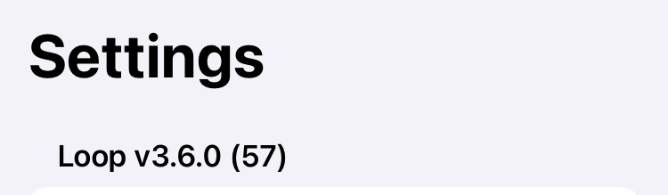

## Loop Releases

The new features added with each Loop release are provided for reference.

For information about version 2 releases and compatibility between version 2 and 3, refer to [Older Releases](releases-version2.md){: target="_blank" }.

## Current Release

The current released version for the *Loop* app is 3.6.0. The dates and contents for releases are summarized below in reverse chronological order (so newest release information comes first).

### What Version Do I Have?

Tap on the Settings icon at the toolbar of the *Loop* app and look at the version information at upper left.
    
{width="400"}
{align="center"}

### Is the Released Version Newer?

Release information is found on the [*GitHub*&nbsp;_LoopKit/LoopWorkspace_&nbsp;release page](https://github.com/LoopKit/LoopWorkspace/releases){: target="_blank" }.

Releases from `Loop 3.4.4` and older are reported at [*GitHub*&nbsp;_LoopKit/Loop_&nbsp;release page](https://github.com/LoopKit/Loop/releases){: target="_blank" }.

## Loop 3 Version History

### Loop v3.6.0

*Loop* v3.6.0 was released on 23 April 2025.

* [Link to release notes for Loop 3.6.0](https://github.com/LoopKit/LoopWorkspace/releases/tag/v3.6.0){: target="_blank" }

#### 3.6.0 Highlights

* Add Automatic Certificate Generation and Renewal
* Implement updates to minimize Dexcom G7 outages that were reported over the last few months, possibly related to iOS 18 changes
* Modify the bolus after meals button to say `Save Carbs & Deliver`
* Update Omnipod Eros and DASH repositories: some bug fixes, some improved responses
* Fix a few bugs
    * Fixed: Stale value of the total bolus in the Bolus Progress Display in HUD - UI Bug only
    * Fixed: Glucose change graph 'predicted' effects are inconsistent at different times or between orientations
    * Fixed: Dexcom G7 calibration flags were not decoded correctly
    * Fixed: Dexcom G7 rare but significant date offset for glucose data
        * If the backfillFinished message was not detected and a stale backFill message was applied to a new sensor, the date for that glucose reading would be in error
    * Fixed: The Algorithm Experiments screen could show stale selections - UI Bug only
    * Not Fixed: The Basal Rate section of the Therapy Settings screen does not update until you exit the screen and then return (this will be addressed in a future update) - UI Bug only, and only seen on some phone hardware (like SE phones) with iOS 18

#### 3.6.0 Details

##### Add Automatic Certificate Generation and Renewal

Automatic certificate generation and renewal requires a `Variable` be added to your organization or your repository. Please see these instructions: [Add Variable](../browser/prepare-fork.md#add-variable){: target="_blank" }

##### Maintenance Updates

These maintenance changes do not affect the functioning of the *Loop* app but do enable continued build with current iOS, Xcode and macOS versions, as well as continued operation of the GitHub Actions (Browser Build) capability.

* LoopWorkspace PR 234: Modify GitHub action files to enable automatic renewal of certificates when they expire or are revoked
* LoopWorkspace PR 241, Loop PR 2303: Modify the way the Loop app is versioned - it is now updated in the LoopWorkspace repository instead of the Loop repository - this simplifies version releases
* LoopWorkspace PR 243: Update GitHub action files to use fastlane 2.227.1 and Xcode 16.3
* LoopWorkspace PR 248: Enable GitHub build to continue working after the keepalive-workflow repository was disabled by *GitHub*

##### Feature Updates

These are changes in response to feature requests (`Loop Issues`) that were implemented in the noted submodule. The LoopWorkspace respository was subsequently updated to include the feature.

| Loop Issue | Submodule Updated | PR in Submodule | Request | Modification |
|:--|:--|:--|:--|:--|
| [2168](https://github.com/LoopKit/Loop/issues/2168){: target="_blank" } | Loop | [2300](https://github.com/LoopKit/Loop/pull/2300){: target="_blank" } | Request for message change helpful for little loopers with multiple caregivers; avoid double carbohydrate entry | Change button label to `Save Carbs & Deliver` |

##### Bug Fixes

These are fixes in response to specific bug reports (`Loop Issues`) that were implemented in the noted submodule. The LoopWorkspace respository was subsequently updated to include the bug fix.

| Loop Issue | Submodule Updated | PR in Submodule | Description of bug that is fixed |
|:--|:--|:--|:--|
| [2159](https://github.com/LoopKit/Loop/issues/2159){: target="_blank" } | Loop | [2163](https://github.com/LoopKit/Loop/pull/2163){: target="_blank" } | Glucose change graph 'predicted' effects are inconsistent at different times or between orientations |
| [2196](https://github.com/LoopKit/Loop/issues/2196){: target="_blank" } | Loop | [2295](https://github.com/LoopKit/Loop/pull/2295){: target="_blank" } | Bolus progress can display a stale total delivery value (UI bug only) |
| [2265](https://github.com/LoopKit/Loop/issues/2265){: target="_blank" } | G7SensorKit | [34](https://github.com/LoopKit/G7SensorKit/pull/34){: target="_blank" } | No G7 CGM Updates - Loop Failure |
| [2291](https://github.com/LoopKit/Loop/issues/2291){: target="_blank" } | G7SensorKit | [35](https://github.com/LoopKit/G7SensorKit/pull/35){: target="_blank" } | Backfill from G7 Created Bad Data |
| N/A | Loop | [2297](https://github.com/LoopKit/Loop/pull/2297){: target="_blank" } | Fix display glitch for Algorithm Experiment selections |

##### OmniBLE and OmniKit Updates

Updates were made to the Omnipod pump submodules: OmniBLE and OmniKit. Unless otherwise noted, the following functional updates were made to both submodules with the PR numbers included in parentheses:

* Miscellaneous Omnipod code improvements & cleanup (PR 135, 44)
* Unacknowledged command handling fixes and PodCommsSession improvements (PR 136, 45)
* DASH (OmniBLE only): Don't fail on ack comms error if validated response has been received (PR 137)
* Eros (OmniKit only): return clock icon when isClockOffset is true (PR 46)
* DASH (OmniBLE only): Use alternate type 7 getStatus call for standalone getStatus sessions (matches the Insulet PDM) (PR 138)
* Improved unacknowledged command recovery (PR 139, 47)
* Logic fix for 049 pod fault with concurrent temp basal commands; fixed Trio Issue (PR 140, 48)
* Logic fix for pump manager returns bogus podSuspended; fixed Trio Issue (PR 141, 49)

### Loop v3.4.4

*Loop* v3.4.4 restored the TestFlight expiration date for Browser Build - it was released twice with the same build number. Just make sure your build (for both Browser Build and Mac Build) are later than 12 October 2024.

* The first release on 9 October 2024 inadvertently removed all the improvements from v3.4.3, but did fix the TestFlight expiration date
* The second release on 12 October 2024 restored the improvements from v3.4.3

* [Link to release notes for Loop 3.4.4](https://github.com/LoopKit/Loop/releases/tag/v3.4.4){: target="_blank" }

### Loop v3.4.3

*Loop* v3.4.3 was released on 6 October 2024.

A few days later, it was discovered that the TestFlight expiration date was no longer available for Browser Build (due to a change in 3.4.2). This was quickly remedied with the *Loop* 3.4.4 release.

This was a minor update to the *Loop* code with a few bug fixes and some capability extensions.

!!! important "Please use the `main` branch"
    Some people have become complacent about using the `dev` branch to get the latest updates. This is a good time to switch to the `main` branch.
    
    New revision will be landing in the `dev` branch soon. Don't be surprised - stick with `main` until the changes have been tested.

* [Link to release notes for Loop 3.4.3](https://github.com/LoopKit/Loop/releases/tag/v3.4.3){: target="_blank" }

These updates were incorporated in this release. The pull request for each modification is linked in parentheses.

* CGMBLEKit: Add ONE to the display name ([194](https://github.com/LoopKit/CGMBLEKit/pull/194){: target="_blank" })

* G7SensorKit: Add ONE+ to the display name ([28](https://github.com/LoopKit/G7SensorKit/pull/28){: target="_blank" })

* LibreTransmitter: 
    * support the newer libre 2 plus european sensors ([14](https://github.com/LoopKit/LibreTransmitter/pull/14){: target="_blank" })
    * fix: Prevent notification from sending if it isnt enabled ([15](https://github.com/LoopKit/LibreTransmitter/pull/15){: target="_blank" })
    * increase build speed for Xcode 16 ([16](https://github.com/LoopKit/LibreTransmitter/pull/16){: target="_blank" })

* LoopKit:
    * Prevent app crash while moving presets ([540](https://github.com/LoopKit/LoopKit/pull/540){: target="_blank" })
    * fix locale for CarbEntry decimal separator ([546](https://github.com/LoopKit/LoopKit/pull/546){: target="_blank" })
    * Improve the visibility of the options to select ([549](https://github.com/LoopKit/LoopKit/pull/549){: target="_blank" })

* Several fixes for OmniBLE (DASH), OmniKit (Eros)
    * update_pump_manager ([125](https://github.com/LoopKit/OmniBLE/pull/125){: target="_blank" }, [36](https://github.com/LoopKit/OmniKit/pull/36){: target="_blank" })
    * fix/bogus_suspend_msg ([126](https://github.com/LoopKit/OmniBLE/pull/126){: target="_blank" }, [37](https://github.com/LoopKit/OmniKit/pull/37){: target="_blank" })
    * podAlreadyPaired-fix ([127](https://github.com/LoopKit/OmniBLE/pull/127){: target="_blank" }, [38](https://github.com/LoopKit/OmniKit/pull/38){: target="_blank" })
    * fix/deactivate-sideways-pull ([128](https://github.com/LoopKit/OmniBLE/pull/128){: target="_blank" }, [39](https://github.com/LoopKit/OmniKit/pull/39){: target="_blank" })
    * increase build speed for Xcode 16 ([131](https://github.com/LoopKit/OmniBLE/pull/131){: target="_blank" }, [40](https://github.com/LoopKit/OmniKit/pull/40){: target="_blank" })

The Browser Build method was updated to use `Fastlane version 2.223.1`. This change ([208](https://github.com/LoopKit/LoopWorkspace/pull/208){: target="_blank" }) fixes a build error reported by several folks across the Open Source app community. This was also added to LoopWorkspace `dev` branch ([207](https://github.com/LoopKit/LoopWorkspace/pull/207){: target="_blank" }).

### Loop v3.4.2

*Loop* v3.4.2 was released on 5 October 2024.

This was a patch that fixed errors with the expiration date for the Mac-Xcode build method for Xcode 16. No other changes were made. Unfortunately, the method used to fix expiration date for Mac Xcode 16 builders removed the expiration date for Browser Builders. The expiration date for Browser Builders was restored with version 3.4.4.

* [Link to release notes for Loop 3.4.2](https://github.com/LoopKit/Loop/releases/tag/v3.4.2){: target="_blank" }

### Loop v3.4.1

*Loop* v3.4.1 was released on 19 July 2024.

This was a patch that fixed errors with the Browser Build. No other changes were made.

* [Link to release notes for Loop 3.4.1](https://github.com/LoopKit/Loop/releases/tag/v3.4.1){: target="_blank" }

### Loop v3.4.0

*Loop* v3.4.0 was released on 13 July 2024.

* [Link to release notes for Loop 3.4.0](https://github.com/LoopKit/Loop/releases/tag/v3.4.0){: target="_blank" }
* There are some one-time update steps required for those who Build with Browser:
    * [Update from 3.2.x to 3.4](../browser/bb-update.md#update-from-32x-to-34){: target="_blank" }

#### Summary of Important New Features

These features are added:

* [*Libre*](../loop-3/add-cgm.md#libre){: target="_blank" }  support in the *Loop* app
* [Favorite Foods](../loop-3/settings.md#favorite-foods){: target="_blank" } for easy entry of common meals
* [Algorithm Experiments](../loop-3/features.md#algorithm-experiments){: target="_blank" }:
    * [Glucose Based Partial Application](../loop-3/features.md#glucose-based-partial-application-gbpa){: target="_blank" } for Automatic Bolus corrections
    * [Integral Retrospective Correction](../loop-3/features.md#integral-retrospective-correction-irc){: target="_blank" }
* In app warning when a *TestFlight* install build is about to expire
* Omnipod and Nighscout Users: automatic update of CAGE to Nightscout when pod is changed
* Dexcom and Nighscout Users: automatic update of SAGE to Nightscout when Dexcom sensor is changed
* Medtronic and Nighscout Users: automatic update of CAGE to Nightscout when set is changed
* Omnipod Users:
    * Cannula Insertion uses a slider to minimize accidental insertion before pod is attached to the body
    * Pod Deactivate uses a slider to minimize accidental deactivation
    * Pod Set up from Pod Pairing until Cannula is inserted now disables auto-lock of screen
* Browser Builders:
    * improved error messages and automatic rebuild of app to *TestFlight*
    * automatic addition of all services except App Group to the App Service for Identifiers

#### Summary of Bug Fixes

* Widgets:
    * Updated to work with iOS 17
* Dexcom G7 Users:
    * fixed how one item was read from the G7, this bug caused a rare time discrepancy
* Omnipod Users:
    * prevent unnecessary faults (rare but it could happen)
    * improve restarts when app is interrupted during pod setup
    * better detection of communication issues
    * improve handling of alerts
* Fixes for mmol/L users
    * Missed Meal notification calculation is now correct
    * Glucose limits can now use the min or max value with no restrictions
* Nightscout as a CGM works again for older iOS versions, it no longer requires iOS 17

### Loop v3.2.3

*Loop* v3.2.3 was released on September 19, 2023.

This patch release was required for those who build using the *Mac* method.

* There are no changes to app functionality
* Version 3.2.2 and earlier cannot be built using Xcode 15, see [Cycle Inside Loop](../build/build-errors.md#cycle-inside-loop)

### Loop v3.2.2

*Loop* v3.2.2 was released on April 24, 2023.

This is a patch release to fix archiving with Xcode 14.3.

### Loop v3.2.1

Loop v3.2.1 was released on March 20, 2023.

This is a patch release primarily dealing with localization updates.

* G7 Plugin localization fixed: was defaulting to Spanish in some cases.
* Updated translations from translators on Lokalise.
* Many behind-the-scenes fixes for how strings are tracked in the various frameworks that Loop uses, fixing a large number of broken/missing translations.

### Loop v3.2.0

Loop v3.2.0 was released on March 17, 2023.

There are some important bug fixes and new features, so please rebuild to this version as soon as possible.

Pete's announcment:

Loop 3.2 Is released! This contains some very important bug fixes for everyone. If you are running latest dev, you do not need to update, but everyone else running older 3.x versions of Loop should consider upgrading as soon as you can.

[https://github.com/LoopKit/Loop/releases/tag/v3.2.0](https://github.com/LoopKit/Loop/releases/tag/v3.2.0){: target="_blank" }

Bug Fixes (Please update ASAP):

* Omnipod bolus tracking issue fixed: [link](https://github.com/LoopKit/Loop/issues/1941){: target="_blank" }
* Medtronic temp basal tracking issue fixed: [link](https://github.com/ps2/rileylink_ios/pull/775){: target="_blank" }
* Crashes caused by large updates from Apple Health fixed
* Automatic refresh timers for Omnipod (both Dash and Eros) have been removed, to reduce load on pods and reduce frequency of failed pods.

Updates and new Features:

* Missed Meal Notifications. If you want, Loop will detect situations where it looks like you may have consumed carbs but did not enter them into Loop, and will notify you with an easy option to enter the amount, and the time of eating already estimated for you. Find this option in the Alert Management section of Loop settings.
* Tidepool Service added. This lets you upload your diabetes data from Loop to Tidepool! It is in early stages, so there may be issues. Please report any issues you have with this integration on DIY Loop forums, like Zulip, GitHub, or the Looped group.
* Translations! Loop now has very good coverage for several languages, including German, Spanish, Italian, French, Danish, Polish, Dutch, Norwegian, Russian, Turkish, and Romanian!
    * Warning - a few items got overwritten by Spanish - if you can't figure it out, try Google translate
* A new safeguard restricts automatic dosing to keep your IOB below a limit of 2 times your max bolus. Manual dosing can still be delivered to put your IOB above this amount. [link](https://github.com/LoopKit/Loop/pull/1871){: target="_blank" }
* Add missing X-Large watch complications. [link](https://github.com/LoopKit/Loop/pull/1901){: target="_blank" }
* “Deactivate Pod” button on some screens changed to not be so alarming, as it doesn’t actually deactivate the pod, but takes you to a screen where you can, and has an option to cancel: [link](https://github.com/LoopKit/OmniBLE/pull/76){: target="_blank" }

### Loop v3.0.0

After several years of development and a lot of testing, Loop 3 is here!

Loop v3.0.0 was released on January 14, 2023.

[Link to release notes for Loop 3.0](https://github.com/LoopKit/Loop/releases/tag/v3.0.0){: target="_blank" }

!!! warning "Use Script not Zip"
    If you follow that link above, there is an `Assets` section with a zip link

    * Do not try to build from the zip link
    * For Browser Build, refer to: [GitHub Overview](../browser/bb-overview.md)
    * For Build with *Mac* refer to:
        * [Updating](../build/updating.md)
        * [Build the *Loop* App](../build/build-app.md)

!!! tip "Branch Name Change"
    The branch name associated with the latest Loop release is `main`.

    * All new Git `repositories` on *GitHub* will be named `main` instead of `master` starting October 1, 2020
    * GitHub provides tools to assist in modifying existing `repositories` to use main

## `Loop` Version Numbering

With the release of `Loop 3`, there is a new pattern for identifying the releases as distinct from the development work.

Each release uses 3 numbers: Major.Minor.Patch

* Major is reserved for a significant change in the code, such as occurred going from `Loop 2.2.9` to `Loop 3.0.0`
* Minor is used when the development branch is released for general use
* Patch typically indicates a modification for a quick bug-fix or to support external events like an Xcode or iOS version update with no feature changes in Loop

To prevent confusion between versions used for development and versions used for release (`main` `branch`), the Minor values are even for released code. The Minor value for the development `branch` (`dev`) is incremented as part of the release process and is always odd.

For example:

* `Loop 3.0.0` was the first released version of `Loop 3`
    * `Loop 3.1.0` was the development version before `Loop 3.2.0` was released
* `Loop 3.2.0` was the next released version
    * `Loop 3.2.1, 3.2.2 and 3.2.3` are patches to `Loop 3.2.0` without changes to the features of `Loop 3.2.x`
    * `Loop 3.3.0` was the development version before `Loop 3.4.0` was released
* `Loop 3.4.0` was the next released version
    * `Loop 3.4.1`, `Loop 3.4.2`, `Loop 3.4.3` and `Loop 3.4.4` are patched versions without major changes to the features of `Loop 3.4`
    * `Loop 3.5.0` was the development version before `Loop 3.6.0` was released
* `Loop 3.6.0` is the current released version
    * `Loop 3.7.0` is the current development version

## Remove Apps with Shared App Group

There are a number of Open Source apps which use the Loop App Group to share data.

One consequence of this is that if you delete one of those apps, there may be saved information on the phone that is **not** discarded. Normally this is not a problem, but sometimes you really want to wipe out all the stored information.

If you are in a situation where you want to completely wipe all data from your phone for any of these apps which use the Loop App Group, you might need to delete all of them:

* Active Apps: *`Loop`*, *`xDrip4iOS`*, *`Glucose-Direct`*, *`iAPS`*
* Old Apps that might be hanging around: *`FreeAPS`*, *`FreeAPS X`* and the *`G5 Transmitter Reset`* app

These apps either have their own App Group or do not use an App Group and do not need to be deleted:

* *`LoopFollow`*, *`LoopCaregiver`*, *`Trio`*
